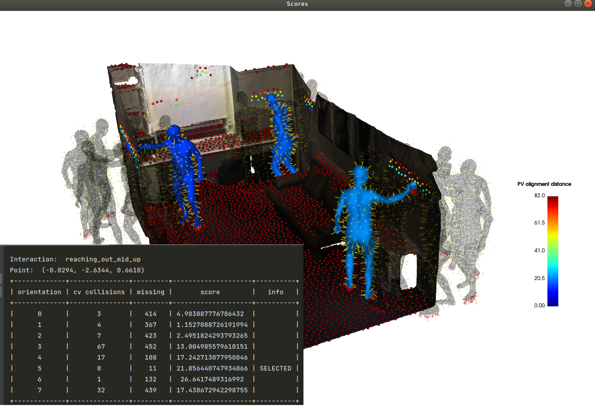
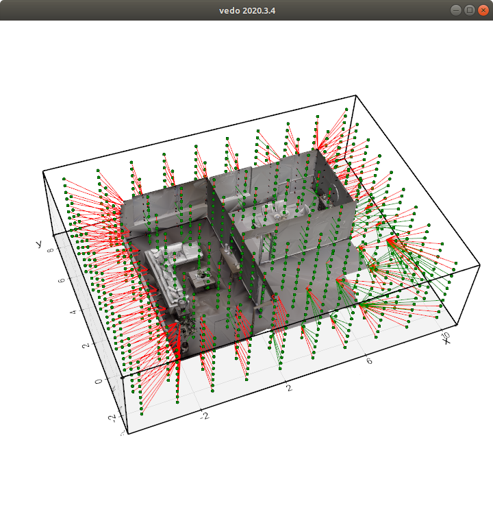
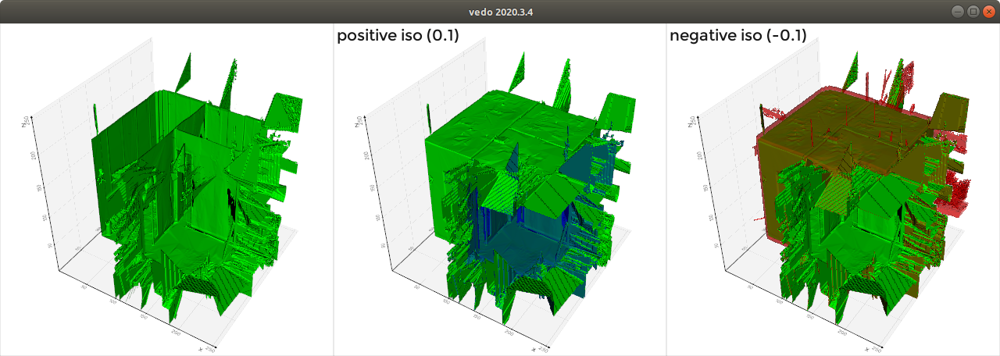

# iTClearance_PLACE

### examples/viz_recordings
For visualizing prox dataset and training iTClearance with those inputs

### examples/comparisson/training/05_visualization_point_tested.py
Visualizing results on after an execution on an environment to verify how iTClearance is capable of detect godd positions to perform an interaction 

### examples/comparisson/sdf_generation/02_sdf_calculation_following_prox.py

### examples/comparisson/sdf_generation/03_sdf_to_mesh_enhanced_visualization.py

